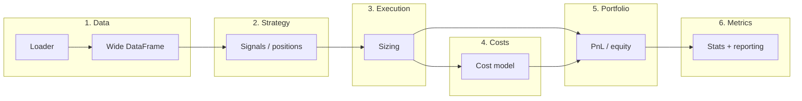

# Custom backtester: components, structure, and design

Unified plan in **chronological pipeline order**: overview → data (and splits) → strategy → execution → costs → portfolio → metrics → engine (flow and results) → folder structure → design constraints. **Going forward, all backtester-related planning will live in this single plan** and be updated here rather than in separate plans.

---

## Part 1 – Pipeline overview (components)

A custom backtester is a pipeline: **data → signals → positions → execution/costs → portfolio/equity → metrics and reporting**.


| Component                  | Purpose                                                                                                                           |
| -------------------------- | --------------------------------------------------------------------------------------------------------------------------------- |
| **1. Data**                | Load and align price (and optionally volume) into a consistent time series per instrument (e.g. wide DataFrame: date × ticker).   |
| **2. Strategy**            | From market data (and params), produce signals or target positions over time. No PnL—only "what the strategy wants to do."        |
| **3. Execution / sizing**  | Turn signals into sizes (notional or shares). In backtests often "get desired size at bar close"; can add caps, vol-target, etc.  |
| **4. Costs**               | Model transaction costs (and optionally financing) so equity and metrics reflect realistic drag (e.g. bps per trade, commission). |
| **5. Portfolio / equity**  | Aggregate positions and PnL across instruments and time into portfolio value and equity curve; handle multi-asset if needed.      |
| **6. Metrics / reporting** | Compute performance and risk stats (Sharpe, CAGR, drawdown, n_trades) and optionally plots/export.                                |


Pipeline flow:




---

## Part 2 – Data and train/validation/test splits

**Load:** The data layer loads price data (e.g. from configurable CSV paths) into a single wide DataFrame (date × ticker) for the requested tickers and date range.

**Split:** After the loader returns the full series, a **splitter** (`backtester/data/splitter.py`) takes that DataFrame plus split configuration and returns three datasets in strict time order: **train**, **validation**, and **test** (no look-ahead).

- **Contract:** Caller provides either **ratios** (e.g. 0.6 / 0.2 / 0.2) or **explicit date boundaries** (train_end, val_end). Splitter returns e.g. `(train_df, val_df, test_df)` or a small dataclass holding the three DataFrames and their date ranges. Splits are contiguous and ordered: `train_end < val_end < test_end`.
- **Temporal guarantee:** Train period ends before val starts; val ends before test starts.
- **Warm-up overlap:** Strategies with rolling indicators (e.g. rolling OLS, rolling z-score) need `lookback` bars of history before they produce valid output. The splitter (or engine) handles this by including a **warm-up prefix** when preparing each segment: when running on val, prepend the last `lookback` bars of train; when running on test, prepend the last `lookback` bars of val (or train if no val). The strategy runs on the extended segment (warm-up + evaluation range), but **portfolio and metrics trim** the warm-up bars so only the true segment dates contribute to PnL and statistics. This avoids NaN or incomplete rolling values at the start of each segment without leaking future information (the warm-up bars are from **before** the segment, not after).

**Integration:**

1. **Loader** → full wide DataFrame.
2. **Splitter** → train / validation / test DataFrames (or views/slices). No information from val or test when defining train; none from test when defining val or train.
3. **Strategy fit/calibrate (optional):** Any parameters to learn are **fitted on training data only**. A `fit(train_df, params)` (if any) must not see val or test.
4. **Validation (optional):** Hyperparameter tuning or model selection can use **validation** data; val is never used for fitting model parameters, only for selecting among candidate configs.
5. **Test:** Final backtest and reported metrics run on **test** data only. Strategy uses parameters (and optional fitted state) from train (and optionally tuning from val); execution, costs, portfolio, and metrics run as usual on the test segment. Metrics can be reported **per split** or only on test.
6. **Engine:** Accepts either (a) pre-split data `(train_df, val_df, test_df)` or (b) full DataFrame + split config and calls the splitter internally. Config holds default split ratios or dates (e.g. in `config.py`).

**Data flow with splits:**

```
Loader → full wide DataFrame
              ↓
Splitter (ratios or dates) → train_df, val_df, test_df
              ↓
Strategy: fit on train (if needed); optionally tune on val; generate positions on test (and optionally report on train/val too)
              ↓
Execution / costs / portfolio / metrics run on each segment as needed; final reported metrics typically on test.
```

---

## Part 3 – Strategy module: expected outputs

The strategy layer produces **signals or target positions** only; it does not compute PnL or costs.

**Contract (what the strategy is expected to generate):**

- **Inputs:** Market data for the instrument(s)—e.g. a wide DataFrame (date × ticker) or a slice of it for the pair—plus strategy parameters (e.g. `lookback`, `entry_z`, `exit_z` for z-score pairs).
- **Optional `fit(data, params)`:** If the strategy has learnable parameters, it exposes a `fit` method that is called on **training data only** (see Part 2). After fitting, the strategy stores any learned state internally. Strategies with no learnable parameters (e.g. fixed z-score thresholds) can omit `fit` or make it a no-op.
- **`compute_signals(data, params) → positions`:** The main method. Called on any segment (train, val, or test) and returns positions. If the strategy was fitted, `compute_signals` uses the fitted state without re-learning.
- **Output:** A **position series** aligned to the same index (dates) as the input data. For a single spread:
  - **Discrete:** Integer or float positions in "strategy units," e.g. `+1` (long spread), `-1` (short spread), `0` (flat). Same length as the input bar count; no look-ahead.
  - **Optional extras:** Some strategies may also expose **spread series** and **scale inputs** (e.g. rolling `avg_spread`, hedge ratio β) if the execution layer needs them for sizing; the minimum the engine needs is the **position series**.

**For z-score pairs specifically:**

- Strategy returns a 1-D array or Series of positions in `{-1, 0, 1}` (and optionally the spread series and/or β so execution can compute `scale = capital / avg_spread`). Execution and portfolio do not interpret the strategy's internal state—only the position series (and any agreed optional fields) are part of the contract.

**Multi-asset / multi-strategy (future):**

- Strategy could return a DataFrame (date × instrument) of target weights or positions. Execution then sizes each row; portfolio aggregates. The design document assumes single-pair for now; the contract above extends to multi-asset by making the position output a matrix.

---

## Part 4 – Execution step: logic

Execution turns **strategy outputs** (target positions in strategy units) into **sized positions** (notional or units used for PnL and costs). It does not change direction or timing.

**Inputs:**

- **Target positions** from the strategy (e.g. a series of +1 / -1 / 0 per bar).
- **Market data** for the bar(s): e.g. spread level, rolling `avg_spread`, or volatility—whatever the sizing rule needs.
- **Parameters:** e.g. `capital`, optional `max_leverage`, `vol_target_ann`.

**Logic:**

1. **Interpret strategy output**
  Strategy says "how much" in its own units (e.g. 1 unit of spread). Execution only scales; it does not override direction or when to trade.
2. **Compute notional size**
  - **Pairs / spread:** One "unit" of spread is scaled so notional ≈ capital: e.g. `scale = capital / avg_spread` (with a sensible default if `avg_spread <= 0`).
  - **Sized position:** `sized = signal * scale` (signal is +1 / -1 / 0). So execution outputs either the same position series plus a single `scale`, or a series of **sized notionals**; portfolio and costs use this for dollar PnL and cost.
3. **Optional constraints**
  - Cap notional at `capital * max_leverage`.
  - Vol-target: scale down when current volatility exceeds target.
  - Minimum trade size: no trade if notional < threshold.
4. **Output**
  - **Sized positions** per bar: either (position_series, scale) or a notional series, so that portfolio can compute PnL as `position × spread_change × scale` (or equivalent) and costs can apply `cost_bps` to notional traded.

**Flow:**

```
Strategy  →  target positions (e.g. ±1 or 0)
                  ↓
Execution →  scale = capital / avg_spread; optional caps  →  sized notional (or units + scale)
                  ↓
Costs     →  apply cost_bps to notional traded
Portfolio →  PnL = position × spread_change × scale; update equity
```

**Z-score pairs example:** Strategy outputs `pos` in {-1, 0, 1}. Execution takes `pos`, `capital`, and `avg_spread` (e.g. rolling mean of |spread|); computes `scale = capital / avg_spread`; outputs `pos` and `scale` (or `sized_notional = pos * scale`) for portfolio and costs.

---

## Part 5 – Costs step: logic

The costs layer turns **position changes** and **notional** into **transaction cost** (and optionally financing) per bar, so that portfolio PnL and equity reflect realistic drag. It does not decide when to trade—only how much to subtract when a trade occurs.

**Inputs:**

- **Position series** (or position changes): current and previous position, or the **change in position** per bar (e.g. `pos_delta = |pos[t] - pos[t-1]|`). For discrete ±1/0, the change is 0 (no trade), 1 (enter or exit one side), or 2 (flip from +1 to -1 or vice versa).
- **Notional:** The size of the position in currency terms. Typically the **same notional used for PnL**—e.g. `capital` (fixed per trade) or the **sized notional** from execution (`position × scale`). Cost is applied to the notional that is **traded** (entered or exited), not necessarily the full book.
- **Parameters:** e.g. `cost_bps` (cost in basis points — per-leg by default; see convention below), optional fixed commission per trade.

**Logic:**

1. **When to charge**
  Cost is incurred only when the **position changes**: entering (0 → ±1), exiting (±1 → 0), or flipping (±1 → ∓1). No cost when position is unchanged.
2. **What notional to apply**
  - **Simple (e.g. z-score pairs):** Charge on a **fixed notional per unit of position change**—e.g. `capital` per "unit" traded. So if we trade one unit of spread (notional ≈ capital), cost = `capital × (cost_bps / 10_000)`. If we flip (two units traded), cost = 2 × that.
  - **Alternative:** Charge on the **actual notional traded** that bar (e.g. from execution's sized notional). Same formula: `notional_traded × (cost_bps / 10_000)`.
3. **Per-leg vs round-trip convention**
  - **Per-leg (default):** `cost_bps` is the cost for **one leg** (one position change). Each position change of one unit is charged once: `cost_per_unit = capital × (cost_bps / 10_000)`, and `daily_cost = pos_delta × cost_per_unit` (where `pos_delta = |pos[t] - pos[t-1]|`). A full round trip (enter then later exit = 2 separate position changes on 2 different bars) costs 2 × `cost_per_unit` total. A same-bar flip (+1 → −1, `pos_delta = 2`) also costs 2 × `cost_per_unit`.
  - **Round-trip alternative:** If the caller provides a round-trip cost (total for entry + exit combined), use half per leg: `cost_per_leg = capital × (cost_bps / 2 / 10_000)`, then `daily_cost = pos_delta × cost_per_leg`. Config should document which convention is in use.
4. **Optional extensions**
  - Fixed **commission** per trade (e.g. dollars per order) in addition to bps.
  - **Financing:** Borrow cost for short positions, or interest on cash; applied per bar from portfolio state.
  - **Spread/slippage:** Model as an extra bps or fixed amount on the notional traded.
5. **Output**
  - A **cost series** (same length and index as the bars): cost in currency per bar. Portfolio subtracts this from gross PnL to get net PnL and update equity.

**Flow:**

```
Execution →  sized notional (or position + scale)
                  ↓
Costs     →  pos_delta = |position change|; cost = pos_delta × notional × (cost_bps/10_000)  →  cost per bar
                  ↓
Portfolio →  net_pnl = gross_pnl - cost; update equity
```

**Z-score pairs example:** Position series `pos` in {-1, 0, 1}; notional per unit = `capital`. `pos_delta[t] = |pos[t] - pos[t-1]|` (0, 1, or 2). `cost_per_unit = capital × (cost_bps / 10_000)`. `daily_cost[t] = pos_delta[t] × cost_per_unit`. Cost series is subtracted from daily PnL before portfolio aggregates.

---

## Part 6 – Portfolio step: logic

The portfolio layer **aggregates positions, PnL, and costs** bar-by-bar into an **equity curve** and a **net PnL series**. It is the single place that combines execution output, market data, and costs to produce the time series that metrics (and reporting) consume.

**Inputs:**

- **Sized positions** (or position series + scale) from execution: at each bar, how much we are long or short in notional or "units" that can be converted to PnL using market data.
- **Market data** for the same bars: e.g. spread series (or prices for each leg) so we can compute **spread change** or price change. Portfolio needs the change in the thing we have exposure to (spread or single-asset return).
- **Cost series** from the costs module: currency cost per bar (same length and index as bars).
- **Initial capital:** Starting equity (e.g. for reporting return as fraction of capital).

**Logic:**

1. **Gross PnL per bar**
  For a spread: `gross_pnl[t] = position[t-1] × spread_change[t] × scale`. Position at `t-1` earns the change from `t-1` to `t`. Spread change = `spread[t] - spread[t-1]` (or log-return if desired). Scale is the same as in execution (e.g. `capital / avg_spread`). For a single asset, same idea: position × price change (or return) × scale.
2. **Net PnL per bar**
  `net_pnl[t] = gross_pnl[t] - cost[t]`. Cost is the transaction cost (and optionally financing) for that bar from the costs module.
3. **Equity curve**
  `equity[0] = capital` (or equity at start of segment). Then `equity[t] = equity[t-1] + net_pnl[t]`. So equity is cumulative net PnL plus initial capital. Optionally track cash and position value separately for multi-asset or margin; for a simple spread backtest, equity and net PnL series are enough.
4. **Alignment**
  All series (positions, spread, cost, gross PnL, net PnL, equity) share the same index (dates). Warm-up bars (e.g. before lookback is full) can be excluded from equity/PnL or kept with NaN; the engine or metrics can trim to the evaluation range.
5. **Multi-asset (future)**
  For multiple instruments or strategies: sum gross PnL across legs/strategies per bar, subtract total cost, then update a single equity curve. Optionally maintain per-instrument positions and PnL for attribution.

**Output:**

- **Equity curve:** Series of portfolio value over time (capital + cumulative net PnL).
- **Net PnL series:** Daily (or per-bar) net PnL, used by metrics and plots.
- Optionally: gross PnL series, position series, trade count or trade log for diagnostics.

**Flow:**

```
Execution →  position + scale (or sized notional)
Costs     →  cost per bar
                  ↓
Portfolio →  gross_pnl = position × spread_change × scale; net_pnl = gross_pnl - cost; equity = cumsum(net_pnl) + capital
                  ↓
Metrics   →  consume equity and/or pnl_series
```

**Z-score pairs example:** Position `pos`, spread series, scale from execution; cost series from costs. `spread_chg[t] = spread[t] - spread[t-1]`. `gross_pnl[t] = pos[t-1] * spread_chg[t] * scale`. `net_pnl[t] = gross_pnl[t] - cost[t]`. `equity = capital + cumsum(net_pnl)`. Drop or mask warm-up bars (first `lookback` or so) so metrics and plots use the same range.

---

## Part 7 – Metrics step: logic

The metrics layer takes the **equity curve** and/or **PnL series** from the portfolio and computes **performance and risk statistics**. It does not run the strategy, execution, or portfolio—only pure computation on the resulting series.

**Inputs:**

- **PnL series** (net, per bar or daily) and/or **equity curve** from the portfolio. Either is enough to derive the other (equity = capital + cumsum(pnl); pnl = diff(equity) if we have equity).
- **Initial capital** (for return and CAGR).
- **Trading days** (or bar count) in the evaluation window, for annualization. Optional: risk-free rate for excess-return Sharpe.

**Logic:**

1. **Total PnL**
  `total_pnl = pnl_series.sum()` or `equity[-1] - capital` (or `equity[-1] - equity[0]` if equity[0] = capital).
2. **Sharpe ratio (annualized)**
  Mean and std of **daily** (or per-bar) PnL. `sharpe = mean(pnl) / std(pnl) * sqrt(252)` (or sqrt(bars_per_year)). If std is 0, define sharpe as 0 or NaN. Optionally use excess return over risk-free rate.
3. **CAGR (compound annual growth rate)**
  `gross = 1 + total_pnl / capital`; if gross > 0 and days > 0: `cagr = gross^(252/days) - 1`. Express as decimal or percent (e.g. 0.05 or 5%).
4. **Max drawdown**
  From equity curve: running maximum (peak), then drawdown at each bar = (peak - equity) / peak (or peak - equity in currency). Max drawdown = max of those drawdowns over the period. Optionally report as fraction (e.g. 0.15) or percent.
5. **Trade count**
  Number of times the position changed (e.g. `(position.diff() != 0).sum()` or from a trade log). Used for reporting and filters (e.g. minimum trades).
6. **Other (optional)**
  Volatility of returns (e.g. std of daily returns annualized), Sortino ratio, Calmar ratio (CAGR / max_dd), win rate, profit factor, average trade PnL. All derived from the same PnL or equity series.

**Output:**

- A **dict or dataclass** of metrics: e.g. `total_pnl`, `total_cost`, `sharpe`, `cagr`, `max_drawdown`, `n_trades`, `days`, `mean_daily_pnl`, `std_daily_pnl`. Optionally the same module (or reporting) returns the **pnl_series** and **equity** for plotting.

**Flow:**

```
Portfolio →  equity, pnl_series
                  ↓
Metrics   →  total_pnl, sharpe, cagr, max_dd, n_trades, ...  →  summary dict / BacktestResult
                  ↓
Reporting / engine  →  display, export, or pass to caller
```

**Z-score pairs example:** Pass `pnl_series` (after warm-up) and `capital`. Compute total_pnl, mean_daily, std_daily, sharpe = mean_daily/std_daily * sqrt(252), days = len(pnl_series), cagr from total_pnl and days, max_drawdown from equity = capital + cumsum(pnl), n_trades from position changes. Return a single summary dict for the backtest run (and optionally keep pnl_series for plots).

---

## Part 8 – Engine: flow and results

The **engine** (`backtester/engine.py`) is the top-level orchestrator. It wires data → splitter (optional) → strategy → execution → costs → portfolio → metrics and returns (and optionally saves) results.

**How the engine runs:**

1. **Load data**
  Call the data loader with config (data path, tickers, date range). Receive a single wide DataFrame (date × ticker).
2. **Split (optional)**
  If train/val/test is requested, call the splitter with the full DataFrame and split config (ratios or date boundaries). Get `train_df`, `val_df`, `test_df`. If not requested, use the full DataFrame as a single "test" segment.
3. **Strategy fit (optional)**
  If the strategy has a `fit` method and train data exists, call `strategy.fit(train_df, params)` once. The strategy stores learned state internally.
4. **Run pipeline per segment (with warm-up)**
  For each segment that should be evaluated (e.g. test only, or train + val + test for diagnostics), in order:
  - **Prepare warm-up:** Prepend `lookback` bars from the preceding segment (see Part 2) so rolling indicators have full history from bar one of the evaluation range.
  - **Strategy:** `compute_signals(extended_segment_df, params)` on the warm-up + evaluation range. Returns positions for the full extended range.
  - **Execution:** From positions and market data (e.g. spread, avg_spread), compute scale and sized positions.
  - **Costs:** From position changes and notional, compute cost series.
  - **Trim warm-up:** Discard the first `lookback` bars from positions, costs, and market data so only the true evaluation range remains.
  - **Portfolio:** From trimmed positions, spread (or price) series, scale, and cost series, compute gross PnL, net PnL, equity curve.
  - **Metrics:** From equity and/or PnL series (and position series for n_trades), compute summary stats.
5. **Collect results**
  For each segment run, keep: metrics dict, pnl_series, equity series, optional position/cost series. If multiple segments (train/val/test), store results keyed by segment name (e.g. `results["test"]`, `results["train"]`).
6. **Return**
  Return a **result object** (e.g. `BacktestResult`) that holds:
  - **Per-segment (or single run):** `metrics` (dict), `pnl_series`, `equity`, optional `positions`, `config_snapshot` (params used).
  - **Segment label:** e.g. `"test"` or `"full"` when no split.

**What the engine returns (in memory):**

- **BacktestResult** (or equivalent): attributes such as `metrics` (total_pnl, sharpe, cagr, max_drawdown, n_trades, days, etc.), `pnl_series`, `equity`, optionally `positions`, `segment` name, `params`/config used. Caller can inspect, pass to reporting, or save to disk.

**Where and what results are saved:**

- **Default: no automatic disk write.** The engine returns the result object; the **caller** decides whether and where to save (e.g. script or notebook writes CSV, JSON, or plots).
- **Optional: configurable output path.** If the engine (or a thin wrapper) accepts an optional `results_dir` or `output_path` (e.g. from config or `run_backtest(..., save_to=None)`), it can persist:
  - **Summary:** One file per run, e.g. `results/{run_id}_summary.csv` or `summary.json` with metrics and run metadata (segment, params, timestamp).
  - **Series (optional):** `pnl_series` and `equity` as CSV (date, pnl, equity) for the requested segment(s), e.g. `results/{run_id}_equity.csv`.
  - **Plots (optional):** If a reporting module exists, engine or caller can generate cumulative PnL and drawdown plots and save to `results/` or a given path.
- **Run identifier:** When saving, use a run id (e.g. timestamp, or hash of config + pair name) so multiple runs do not overwrite. Config can define `results_dir` (e.g. `backtester/results/` or a path under project root); the engine does not create this by default unless "save" is requested.

**Summary:**

- Engine runs the pipeline in order; optionally splits data and fits strategy on train; runs strategy → execution → costs → portfolio → metrics on the chosen segment(s).
- Returns a **BacktestResult** (metrics, pnl_series, equity, optional positions/config) in memory.
- **Saving is optional:** caller saves, or engine/wrapper writes to a configurable `results_dir` (summary CSV/JSON, optional series CSV, optional plots) with a unique run id when requested.

---

## Part 9 – Folder structure

**Project root:** Three sibling folders at the top level—**backtester**, **research**, and **functions**. Common reusable logic lives in **functions** so it can be used by both backtester and research (and any other future modules) without coupling them to each other.

```
quant-trading/                 # project root
├── backtester/                # backtester package (see below)
├── research/                  # existing research code (unchanged)
└── functions/                 # shared, reusable helpers (no research- or backtester-specific code)
    ├── __init__.py
    └── ...                    # e.g. date helpers, math/stats utils, I/O helpers
```

**backtester/** is a self-contained package. Internal layout aligned to the pipeline:

```
backtester/
├── __init__.py              # Package API: e.g. run_backtest, BacktestEngine
├── config.py                # Defaults: lookback, entry_z, exit_z, capital, cost_bps, data paths, split ratios
│
├── data/
│   ├── __init__.py
│   ├── loader.py             # Load prices from CSV (path/layout configurable); output wide DataFrame
│   └── splitter.py           # Split full series into train / validation / test by time (no look-ahead)
│
├── strategy/
│   ├── __init__.py
│   ├── base.py              # Abstract interface: compute_signals(data, params) → positions
│   └── zscore_pairs.py      # Rolling β, spread, z-score, entry/exit → positions
│
├── execution/
│   ├── __init__.py
│   └── sizing.py            # Position sizing (e.g. scale by capital/avg_spread)
│
├── costs/
│   ├── __init__.py
│   └── transaction.py        # Cost model (e.g. bps on notional per trade)
│
├── portfolio/
│   ├── __init__.py
│   └── engine.py            # Bar-by-bar state: positions, PnL, equity (single or multi-asset)
│
├── metrics/
│   ├── __init__.py
│   └── performance.py       # Sharpe, CAGR, drawdown, n_trades; input: equity or pnl_series
│
└── engine.py                # Orchestrator: data → strategy → execution → costs → portfolio → metrics
```

- **functions/** (at project root): Holds only **generic, reusable** code—e.g. date/datetime helpers, small math or stats utilities, generic file/path helpers. No imports from `research/` or `backtester/`; both research and backtester may import from `functions`. Keeps shared logic in one place and avoids duplication.
- Optional later: **backtester/reporting/** (plots, export), **tests/backtester/** at repo root for unit tests. Optional **backtester/results/** (or configurable `results_dir`) for saved summary/series/plots when the engine is run with save enabled.

---

## Part 10 – Self-contained design (no relation to existing code)

- **No imports from `research/`.** The backtester does not depend on research code or `backtest_pair`.
- **Shared code:** Common reusable logic lives in the root-level **functions/** package (sibling to `backtester/` and `research/`). Backtester (and research) may import from `functions` for generic helpers (e.g. dates, math, I/O). The `functions` package does not import from `research/` or `backtester/`, so it stays neutral and reusable.
- **Data:** `backtester/data/loader.py` implements loading from scratch (e.g. configurable CSV paths/directory layout), returning a date × ticker wide DataFrame. No use of `research.functions.load_data` or research paths.
- **Strategy / execution / costs / portfolio / metrics:** All backtester-specific logic lives inside `backtester/`; no imports from `research/` or from `backtest_pair`.
- **Config:** `backtester/config.py` holds defaults and data path conventions. Callers pass paths or overrides from outside; the backtester does not depend on the existing `data/` or `research/` layout.
- **Usage:** Code that uses the new backtester imports from `backtester` (and optionally `functions`). The existing research pipeline remains separate and unchanged.

---

## Summary

- **What:** Six components (data, strategy, execution, costs, portfolio, metrics) and one top-level engine that wires them. The engine loads data, optionally splits into train/val/test, optionally fits strategy on train, runs the pipeline (strategy → execution → costs → portfolio → metrics) per segment, and returns a BacktestResult (metrics, pnl_series, equity; optional save to a configurable results_dir). Data can be split by time; strategy produces positions (and optional spread/scale); execution sizes them; costs output a cost series; portfolio produces gross/net PnL and equity; metrics produce summary stats.
- **Where:** At project root: **backtester/**, **research/**, and **functions/** (shared helpers). Backtester layout is as in Part 9; data layer includes `loader.py` and `splitter.py`; engine in `engine.py`; optional results under `results_dir` (e.g. backtester/results/).
- **How:** **Self-contained**—backtester has no relation to research code; it may use the root-level **functions/** package for common utilities. All other dependencies are within `backtester/` or the standard library/third-party packages. Splits are chronological (train < val < test) so there is no look-ahead.

---

## TODOs

### 1. Scaffold
- [ ] Create `backtester/` dir with `__init__.py` (empty or minimal docstring)
- [ ] Create subpackage dirs: `data/`, `strategy/`, `execution/`, `costs/`, `portfolio/`, `metrics/` — each with `__init__.py`
- [ ] Create placeholder files: `config.py`, `engine.py`
- [ ] Create root-level `functions/` dir with `__init__.py`

### 2. Data loader (`backtester/data/loader.py`)
- [ ] Define `load_prices(data_dir, tickers, start_date, end_date, columns)` signature and return type (wide DataFrame)
- [ ] Implement CSV discovery: scan `data_dir` for price files (configurable naming/layout)
- [ ] Read, concatenate, deduplicate, filter by tickers and date range
- [ ] Pivot to wide format (date x ticker on `adj_close` or configurable column) and sort by date

### 3. Data splitter (`backtester/data/splitter.py`)
- [ ] Define `SplitResult` dataclass: `train_df`, `val_df`, `test_df`, `train_range`, `val_range`, `test_range`
- [ ] Implement `split_by_ratio(df, train_ratio, val_ratio)` — compute date boundaries from row counts
- [ ] Implement `split_by_dates(df, train_end, val_end)` — slice by explicit date boundaries
- [ ] Add warm-up overlap: for val and test, prepend `lookback` bars from the preceding segment
- [ ] Store warm-up length in `SplitResult` so engine/portfolio can trim later

### 4. Strategy base (`backtester/strategy/base.py`)
- [ ] Define abstract `Strategy` class (ABC) with `fit(data, params)` as optional no-op
- [ ] Define abstract `compute_signals(data, params) -> StrategyResult`
- [ ] Define `StrategyResult` dataclass: `positions` (Series), optional `spread` (Series), optional `extras` dict (e.g. avg_spread, beta)

### 5. Z-score pairs strategy (`backtester/strategy/zscore_pairs.py`)
- [ ] Subclass `Strategy`; accept `ticker_a`, `ticker_b`, `lookback`, `entry_z`, `exit_z` as params
- [ ] Compute rolling OLS hedge ratio `beta = Cov(x,y)/Var(x)` over lookback window (vectorized)
- [ ] Compute `spread = price_a - beta * price_b`
- [ ] Compute rolling z-score of spread over lookback window
- [ ] Generate positions: +1 when `z < -entry_z`, -1 when `z > entry_z`, 0 when z crosses `exit_z` (state machine loop)
- [ ] Return `StrategyResult` with positions, spread series, and extras (avg_spread, beta)

### 6. Execution / sizing (`backtester/execution/sizing.py`)
- [ ] Define `size_positions(positions, capital, avg_spread, max_leverage=None)` signature
- [ ] Compute `scale = capital / avg_spread` (guard against `avg_spread <= 0`)
- [ ] Optionally cap scale at `capital * max_leverage` if `max_leverage` is provided
- [ ] Return `ExecutionResult` dataclass: `positions` (unchanged), `scale` (float or Series)

### 7. Costs / transaction (`backtester/costs/transaction.py`)
- [ ] Define `compute_costs(positions, capital, cost_bps, round_trip=False)` signature
- [ ] Compute `pos_delta = abs(diff(positions))` per bar
- [ ] Compute `cost_per_unit`: if `round_trip`, `capital * (cost_bps / 2 / 10_000)`; else `capital * (cost_bps / 10_000)`
- [ ] Compute `daily_cost = pos_delta * cost_per_unit`; return cost Series (same index as positions)

### 8. Portfolio engine (`backtester/portfolio/engine.py`)
- [ ] Define `compute_portfolio(positions, spread, scale, cost_series, capital)` signature
- [ ] Compute `spread_change = diff(spread)`; `gross_pnl = positions[:-1] * spread_change * scale`
- [ ] Compute `net_pnl = gross_pnl - cost_series` (aligned by index)
- [ ] Compute `equity = capital + cumsum(net_pnl)`
- [ ] Return `PortfolioResult` dataclass: `equity` (Series), `net_pnl` (Series), `gross_pnl` (Series), `total_cost` (float)

### 9. Metrics / performance (`backtester/metrics/performance.py`)
- [ ] Define `compute_metrics(pnl_series, equity, capital, positions)` signature
- [ ] Compute `total_pnl = pnl_series.sum()`
- [ ] Compute `sharpe = mean(pnl) / std(pnl) * sqrt(252)`; handle `std == 0`
- [ ] Compute CAGR: `gross = 1 + total_pnl/capital`; `cagr = gross^(252/days) - 1`
- [ ] Compute max drawdown from equity: running peak, `drawdown = (peak - equity) / peak`, take max
- [ ] Compute `n_trades` = count of position changes
- [ ] Return dict or `MetricsResult` dataclass with `total_pnl`, `sharpe`, `cagr`, `max_drawdown`, `n_trades`, `days`, `mean_daily_pnl`, `std_daily_pnl`

### 10. Main engine (`backtester/engine.py`)
- [ ] Define `BacktestResult` dataclass: `metrics` (dict), `pnl_series`, `equity`, `positions`, segment label, config snapshot
- [ ] Define `run_backtest(data_dir, tickers, strategy, params, split_config=None, save_to=None)` entry point
- [ ] Step 1: Call loader to get full wide DataFrame
- [ ] Step 2: If `split_config` provided, call splitter; else use full df as single "full" segment
- [ ] Step 3: If strategy has `fit()` and train exists, call `strategy.fit(train_df, params)`
- [ ] Step 4: For each segment — prepend warm-up, run strategy, execution, costs, trim warm-up, portfolio, metrics
- [ ] Step 5: Collect per-segment `BacktestResult` into results dict (e.g. `results["test"]`)
- [ ] Step 6: If `save_to` provided, write summary CSV/JSON and optional equity CSV to `results_dir` with `run_id`
- [ ] Return results dict (or single `BacktestResult` if no split)

### 11. Config (`backtester/config.py`)
- [ ] Define `BacktestConfig` dataclass with fields: `lookback`, `entry_z`, `exit_z`, `capital`, `cost_bps`, `cost_round_trip` (bool), `split_ratios` (tuple), `results_dir` (optional Path)
- [ ] Set sensible defaults (e.g. lookback=60, entry_z=2.0, exit_z=0.5, capital=100_000, cost_bps=5, split_ratios=(0.6, 0.2, 0.2))
- [ ] Allow override via constructor kwargs or a `from_dict()` class method

### 12. Verify
- [ ] Select a sample pair with known data (e.g. from existing `data/` directory)
- [ ] Run `run_backtest` with default config and a 60/20/20 split
- [ ] Check that splitter produces correct date ranges and warm-up lengths
- [ ] Check that strategy positions are in {-1, 0, 1} and have no NaN in the evaluation range
- [ ] Check that cost series is non-negative and only non-zero on position-change bars
- [ ] Check that equity starts at capital and `net_pnl` sums to `equity[-1] - capital`
- [ ] Check that metrics (sharpe, cagr, max_dd, n_trades) are reasonable and consistent with `pnl_series`
- [ ] Confirm warm-up bars are excluded: `pnl_series` length == test segment length (no lookback prefix)
